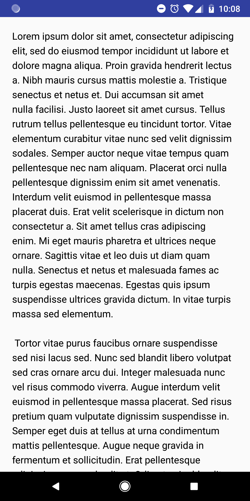
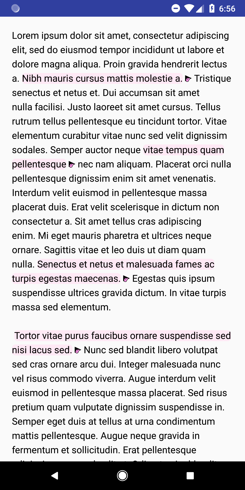
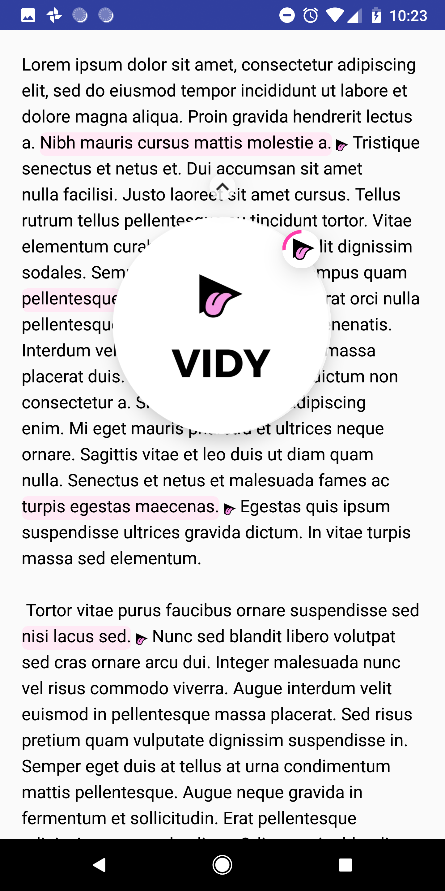
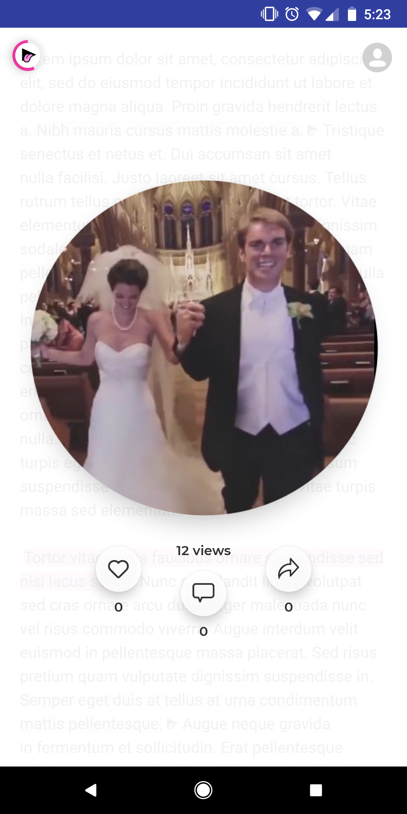

<div align="center">

</div>

# embed-vidy-android-example (OFFLINE ONLY)

## Prerequisites
* Android SDK v17

#### Gradle
Include the following repositories in your `build.gradle` file.
```
repositories {
    maven { url  "https://vidy.bintray.com/maven" }
    maven { url "https://oss.sonatype.org/content/repositories/snapshots" }
}
```
Include the Vidy SDK<br />

`implementation 'com.vidy.sdk:vidysdk:0.0.2'`
## Summary

The Vidy SDK is an android library that injects Vidy's into an android Application. The beauty of the SDK is that it's minimal by design. No custom views required. It works by leveraging TextView's ability to use spannable strings to mark up the text and also adds the Vidy layer. For all intents and purposes, a developer only needs to register their API key and reference the post ID. In an instant, your app will be updated with the Vidys configured in the Publisher dashboard. When the Vidy SDK is initialized, unbeknownst to the user, the SDK is working to precache videos and prepare the Vidy modals. As far as they know, nothing within the app has changed but in actuality, they are being presented with Vidy's revolutionary minimalistic approach to advertising. No longer will users be inundated with gaudy advertisements. Their experience will be seamless, giving power to the user to decide whether or not they want to interact with advertisements.

### OFFLINE

This offline version of the SDK allows for integration without the publisher dashboard. Changes are local to the app and do not integrate with the backend. It is a proof of concept of how Vidy embeds will work. To embed Vidys, you only need to provide matching strings from a TextView and the embeds will be placed in the first occurrence of the string.

## Steps to use

### 1. Initialize App Id (OFFLINE SDK: Any ID)
Set the Application ID in a custom `Application`, `Activity`, or `Fragment`. This only needs to be called one time.
```
VidySdk.setApplicationId("APPLICATION_ID");
```

### 2. Embed Vidy's search
The Vidy SDK can be integrated into an `Activity`, `Fragment`, `ViewGroup`, or `TextView`.
#### Activity
##### List of Strings
```
@Override
protected void onCreate(Bundle savedInstanceState) {
    super.onCreate(savedInstanceState);
    setContentView(R.layout.activity_fullscreen);

    List<String> embedStrings = new ArrayList<>();
    embedStrings.add("Nibh mauris cursus mattis molestie a.");
    embedStrings.add("vitae tempus quam pellentesque");
    embedStrings.add("Senectus et netus et malesuada fames ac turpis egestas maecenas.");
    embedStrings.add("Tortor vitae purus faucibus ornare suspendisse sed nisi lacus sed.");

    VidySdk.init(this, embedStrings);
}
```
##### String Array
```
@Override
protected void onCreate(Bundle savedInstanceState) {
    super.onCreate(savedInstanceState);
    setContentView(R.layout.activity_fullscreen);

    String[] embedStrings = new String[4];
    embedStrings[0]="Nibh mauris cursus mattis molestie a.";
    embedStrings[1]="vitae tempus quam pellentesque";
    embedStrings[2]="Senectus et netus et malesuada fames ac turpis egestas maecenas.";
    embedStrings[3]="Tortor vitae purus faucibus ornare suspendisse sed nisi lacus sed.";

    VidySdk.init(this, embedStrings);
}
```
#### Fragment
##### List of Strings

```
@Override
public View onCreateView(LayoutInflater inflater, ViewGroup container,
                         Bundle savedInstanceState) {
    view = inflater.inflate(R.layout.fragment_layout, container, false);
    List<String> embedStrings = new ArrayList<>();
    embedStrings.add("Nibh mauris cursus mattis molestie a.");
    embedStrings.add("vitae tempus quam pellentesque");
    embedStrings.add("Senectus et netus et malesuada fames ac turpis egestas maecenas.");
    embedStrings.add("Tortor vitae purus faucibus ornare suspendisse sed nisi lacus sed.");

    VidySdk.init(this, view, embedStrings);
    return view;
}
```
##### String Array
```
@Override
public View onCreateView(LayoutInflater inflater, ViewGroup container,
                         Bundle savedInstanceState) {
    view = inflater.inflate(R.layout.fragment_layout, container, false);

    String[] embedStrings = new String[4];
    embedStrings[0]="Nibh mauris cursus mattis molestie a.";
    embedStrings[1]="vitae tempus quam pellentesque";
    embedStrings[2]="Senectus et netus et malesuada fames ac turpis egestas maecenas.";
    embedStrings[3]="Tortor vitae purus faucibus ornare suspendisse sed nisi lacus sed.";

    VidySdk.init(this, view, embedStrings);
    return view;
}
```
#### ViewGroup
##### List of Strings
```
@Override
protected void onCreate(Bundle savedInstanceState) {
    super.onCreate(savedInstanceState);
    setContentView(R.layout.activity_layout);
    ViewGroup viewGroup = (ViewGroup)activity.findViewById(android.R.id.content);

    List<String> embedStrings = new ArrayList<>();
    embedStrings.add("Nibh mauris cursus mattis molestie a.");
    embedStrings.add("vitae tempus quam pellentesque");
    embedStrings.add("Senectus et netus et malesuada fames ac turpis egestas maecenas.");
    embedStrings.add("Tortor vitae purus faucibus ornare suspendisse sed nisi lacus sed.");

    VidySdk.init(this, viewGroup, embedStrings);
}
```
##### String Array
```
@Override
protected void onCreate(Bundle savedInstanceState) {
    super.onCreate(savedInstanceState);
    setContentView(R.layout.activity_layout);
    ViewGroup viewGroup = (ViewGroup)activity.findViewById(android.R.id.content);

    String[] embedStrings = new String[4];
    embedStrings[0]="Nibh mauris cursus mattis molestie a.";
    embedStrings[1]="vitae tempus quam pellentesque";
    embedStrings[2]="Senectus et netus et malesuada fames ac turpis egestas maecenas.";
    embedStrings[3]="Tortor vitae purus faucibus ornare suspendisse sed nisi lacus sed.";

    VidySdk.init(this, viewGroup, embedStrings);
}
```
#### TextView
##### List of Strings
```
@Override
protected void onCreate(Bundle savedInstanceState) {
    super.onCreate(savedInstanceState);
    setContentView(R.layout.activity_layout);
    TextView textView = findViewById(R.id.textView);

    List<String> embedStrings = new ArrayList<>();
    embedStrings.add("Nibh mauris cursus mattis molestie a.");
    embedStrings.add("vitae tempus quam pellentesque");
    embedStrings.add("Senectus et netus et malesuada fames ac turpis egestas maecenas.");
    embedStrings.add("Tortor vitae purus faucibus ornare suspendisse sed nisi lacus sed.");

    VidySdk.init(this, textView, embedStrings);
}
```
##### String Array
```
@Override
protected void onCreate(Bundle savedInstanceState) {
    super.onCreate(savedInstanceState);
    setContentView(R.layout.activity_layout);
    TextView textView = findViewById(R.id.textView);

    String[] embedStrings = new String[4];
    embedStrings[0]="Nibh mauris cursus mattis molestie a.";
    embedStrings[1]="vitae tempus quam pellentesque";
    embedStrings[2]="Senectus et netus et malesuada fames ac turpis egestas maecenas.";
    embedStrings[3]="Tortor vitae purus faucibus ornare suspendisse sed nisi lacus sed.";

    VidySdk.init(this, textView, embedStrings);
}
```
### Vidy Markers
This is an example of what the Vidy SDK can do. The SDK will highlight the text defined in the publisher dashboard. If a user interacts with it a Vidy will pop up.<br /><br />
&nbsp;    &nbsp;    

#### Social Modal
If a user swipes up while holding, they will be taken to the Social Vidy screen.<br /><br />

