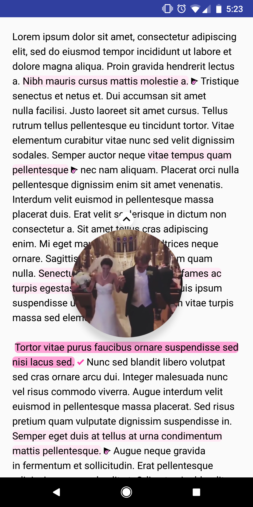
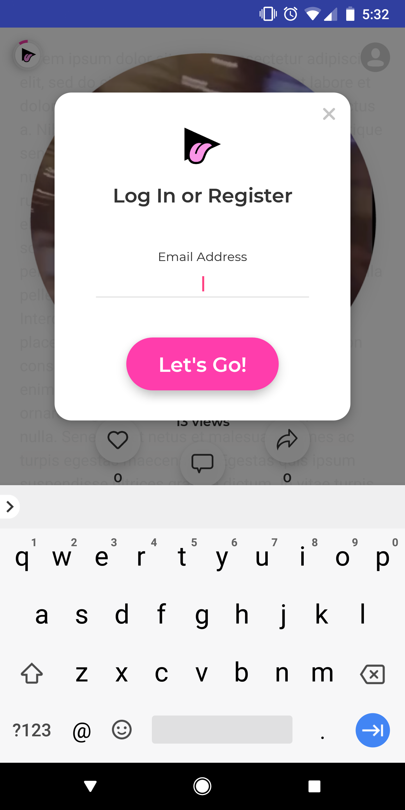

<div align="center">

</div>

## Summary

The Vidy SDK is an Android library that injects Vidy's into an Android Application. 

## Prerequisites
* Android SDK v21

#### Permissions
The Vidy SDK requires the Internet permission. Add the following line to your `AndroidManifest.xml` file.
```
<uses-permission android:name="android.permission.INTERNET" />
```
#### Gradle
Include the following repositories in your `build.gradle` file.
```
repositories {
    maven { url "https://dl.bintray.com/vidycoin/maven" }
    maven { url "https://oss.sonatype.org/content/repositories/snapshots" }
}
```
Include the Vidy SDK.
```
implementation 'com.vidy.sdk:vidysdk:0.1.1'
```

## Steps to use

### 1. Initialize App Id
Set the Application ID in a custom `Application`, `Activity`, or `Fragment`. This only needs to be called one time.
```
VidySdk.setApplicationId("APPLICATION_ID");
```

### 2. Embed Vidy's search
The Vidy SDK can be integrated into an `Activity`, `Fragment`, `ViewGroup`, or `TextView`. 
#### Activity
```
@Override
protected void onCreate(Bundle savedInstanceState) {
    super.onCreate(savedInstanceState);
    setContentView(R.layout.activity_layout);
    VidySdk.init(this, "POST_ID");
}
```

#### Fragment
```
@Override
public View onCreateView(LayoutInflater inflater, ViewGroup container,
                         Bundle savedInstanceState) {
    view = inflater.inflate(R.layout.fragment_layout, container, false);
    VidySdk.init(this, view, "POST_ID");
    return view;
}
```

#### ViewGroup
```
@Override
protected void onCreate(Bundle savedInstanceState) {
    super.onCreate(savedInstanceState);
    setContentView(R.layout.activity_layout);
    ViewGroup viewGroup = (ViewGroup)activity.findViewById(android.R.id.content);
    VidySdk.init(this, viewGroup, "POST_ID");
}
```

#### TextView
```
@Override
protected void onCreate(Bundle savedInstanceState) {
    super.onCreate(savedInstanceState);
    setContentView(R.layout.activity_layout);
    TextView textView = findViewById(R.id.textView);
    VidySdk.init(this, textView, "POST_ID");
}
```
## Output

| Before | After | On Press | 
:-------------------------:|:-------------------------:|:-------------------------:
||


| On Completion | Social | Login |
:-------------------------:|:-------------------------:|:-------------------------:
||

